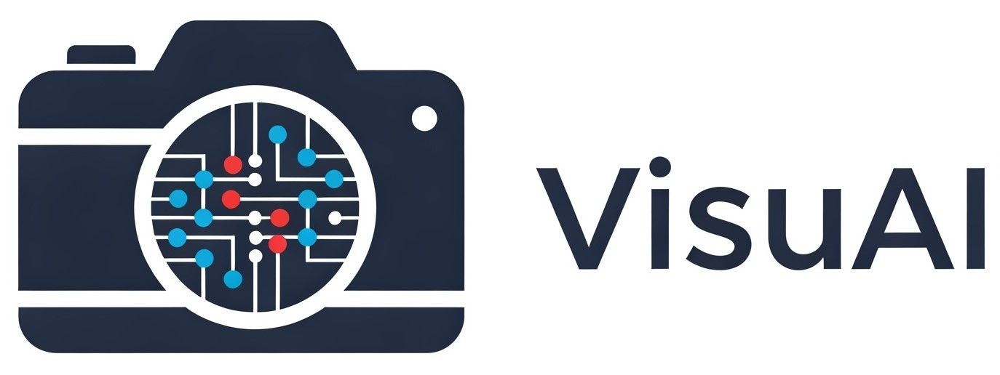
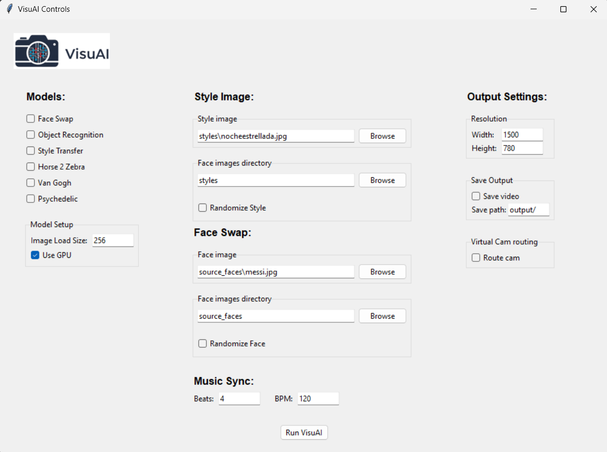

# VisuAI - Real-time AI Visual Effects



VisuAI is an innovative real-time video processing application that brings the power of AI to your webcam. Transform your video feed with stunning visual effects powered by state-of-the-art machine learning models.

## 🎨 Features

- **Real-time AI Effects**: Apply multiple AI-powered visual effects to your webcam feed
- **Multiple Models**: Choose from various AI models including:
  - YOLO object detection
  - Style Transfer
  - CycleGAN transformations (based on [pytorch-CycleGAN-and-pix2pix](https://github.com/junyanz/pytorch-CycleGAN-and-pix2pix))
  - Psychedelic filters
- **Virtual Camera Support**: Stream your AI-enhanced video to web conferencing apps like Google Meet, Microsoft Teams, and Zoom
- **Sync with Music**: Change the style of the image based on the rhythm of the music
- **Customizable Settings**: Fine-tune your experience with adjustable parameters
- **GPU Acceleration**: Optional GPU support for faster processing
- **Video Recording**: Save your transformed video

## 🖥️ Interface



The intuitive interface allows you to:

1. **Model Selection**: Choose which AI models to apply to your video
2. **Style Images**: 
  - Select a style image for style transfer
  - Choose a directory for random style selection
  - Enable/disable style randomization
3. **Timing Controls**: Change the image style to the rythm of music!
  - Set BPM (beats per minute)
  - Configure a number of beats to change the style of the image
4. **Output Settings**:
   - Adjust output video resolution
   - Enable/disable video saving
   - Configure GPU usage
   - Rout output to a virtual camera for web conferencing apps (meet, zoom, teams, etc.)

Your settings are automatically saved and will be restored when you restart the application.

## 🚀 Getting Started

1. Clone the repository
2. Create an environment with python 3.8.2 and activate it (conda example):
   ```bash
   conda create -n visuai python=3.8.2
   conda activate visuai
   ```
3. Install dependencies:
    For Linux:
   ```bash
   bash linux_install_requirements.sh
   ```
    For Windows:
   ```bash
    windows_install_requirements.sh
    ```
4. Run the application:
   ```bash
   python main.py
   ```

## 🌐 Web Video Conference Support

VisuAI can stream its AI-enhanced video feed to web conferencing apps like Google Meet, Microsoft Teams, Zoom, and others using a virtual camera powered by `pyvirtualcam`.

- **Windows Setup**:
  - **Install OBS Studio**: OBS provides the virtual camera driver required by `pyvirtualcam`. Download it from [obsproject.com](https://obsproject.com/) and install it.
  - **Configuration**: Run `main.py`, and VisuAI will output the processed feed to the "OBS Virtual Camera." Select this camera in your conferencing app’s video settings.
- **Usage**: Open your conferencing app, go to video settings, and choose "OBS Virtual Camera" to see VisuAI’s effects live during calls.
- **Troubleshooting**:
  - If the virtual camera doesn’t appear, verify OBS is installed and its virtual camera is stopped.
  - Ensure no other apps are using the virtual camera.
  - Check the console for errors if the feed doesn’t display.

**Note**: On Linux, install `v4l2loopback` (`sudo apt-get install v4l2loopback-dkms`) instead of OBS. On macOS, `pyvirtualcam` typically works without additional software.

## 🎯 System Requirements

- Python 3.8.2 (Due to tensorflow GPU and windows compatibility)
- Webcam
- Optional: NVIDIA GPU for accelerated processing

## 🤝 Contributing

Contributions are welcome! Please feel free to submit a Pull Request.