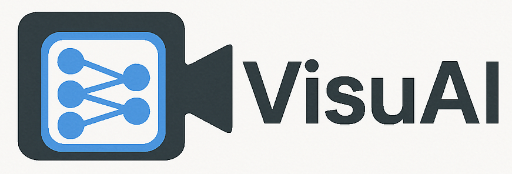

# VisuAI - Real-time AI Visual Effects



VisuAI is an innovative real-time video processing application that brings the power of AI to your webcam. Transform your video feed with stunning visual effects powered by state-of-the-art machine learning models.

## 🎨 Features

- **Real-time AI Effects**: Apply multiple AI-powered visual effects to your webcam feed
- **Multiple Models**: Choose from various AI models including:
  - YOLO object detection
  - Style Transfer
  - CycleGAN transformations (based on [pytorch-CycleGAN-and-pix2pix](https://github.com/junyanz/pytorch-CycleGAN-and-pix2pix))
  - DeepDream effects
  - Psychedelic filters
- **Customizable Settings**: Fine-tune your experience with adjustable parameters
- **GPU Acceleration**: Optional GPU support for faster processing
- **Video Recording**: Save your transformed video to the output folder

## 🖥️ Interface


The intuitive interface allows you to:

1. **Model Selection**: Choose which AI models to apply to your video
2. **Style Images**: 
  - Select a style image for style transfer
  - Choose a directory for random style selection
  - Enable/disable style randomization
3. **Timing Controls**: Change the image style to the rythm of music!
  - Set BPM (beats per minute)
  - Configure a number of beats to change the style of the image
4. **Output Settings**:
   - Adjust output video resolution
   - Enable/disable video saving
   - Configure GPU usage

Your settings are automatically saved and will be restored when you restart the application.

## 🚀 Getting Started

1. Clone the repository
2. Install dependencies:
   ```bash
   pip install -r requirements.txt
   ```
3. Run the application:
   ```bash
   python main.py
   ```

## 🎯 System Requirements

- Python 3.8+
- Webcam
- Optional: NVIDIA GPU for accelerated processing

## 🤝 Contributing

Contributions are welcome! Please feel free to submit a Pull Request.