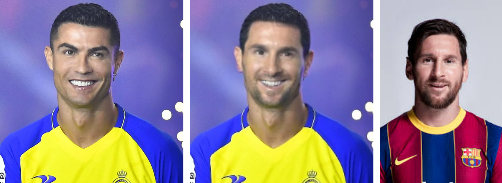

# VisuAI - Real-time AI Visual Effects


VisuAI is an innovative real-time video processing application that brings the power of AI to your webcam. Transform your video feed with stunning visual effects powered by state-of-the-art machine learning models.

## 🎨 Features

- **Real-time AI Effects**: Apply multiple AI-powered visual effects to your webcam feed
- **Multiple Models**: Choose from various AI models including:
  - YOLO object detection
  - Style Transfer
  - One shot Face Swap
  - CycleGAN transformations (based on [pytorch-CycleGAN-and-pix2pix](https://github.com/junyanz/pytorch-CycleGAN-and-pix2pix))
  - Psychedelic filters
- **Virtual Camera Support**: Stream your AI-enhanced video to web conferencing apps like Google Meet, Microsoft Teams, and Zoom
- **Sync with Music**: Change the style of the image based on the rhythm of the music
- **Customizable Settings**: Fine-tune your experience with adjustable parameters
- **GPU Acceleration**: Optional GPU support for faster processing
- **Video Recording**: Save your transformed video

## 🖥️ Interface


The intuitive interface allows you to:

1. **Model Selection**: Choose which AI models to apply to your video
2. **Style Images**: 
  - Select a style image for style transfer
  - Choose a directory for random style selection
  - Enable/disable style randomization
3. **Face Images**: 
  - Select a face image for face swap
  - Choose a directory for random faces selection
  - Enable/disable faces randomization
4**Timing Controls**: Change the image style to the rythm of music!
  - Set BPM (beats per minute)
  - Configure a number of beats to change the style of the image
5**Output Settings**:
   - Adjust output video resolution
   - Enable/disable video saving
   - Configure GPU usage
   - Rout output to a virtual camera for web conferencing apps (meet, zoom, teams, etc.)

Your settings are automatically saved and will be restored when you restart the application.

## 😎 Face Swap

Bring some fun to your feed with **one-shot face swapping**! This feature replaces faces detected in your webcam with a target face image using a pre-trained encoder-decoder model.

- 👤 **Single Face Selection**: Upload any face image to use for swapping.
- 📁 **Batch Face Mode**: Provide a folder with multiple faces to randomly switch between.
- 🔄 **Automatic Face Cycling**: Randomize face swaps every few seconds or in sync with music beats.
- 🧠 **One-shot inference**: Works without the need for multiple examples of the target face.



The face swap engine uses a one-shot facial reenactment model to map expressions and poses from the webcam input onto the chosen target face, while preserving realism and head orientation.inspired by [insightface](https://github.com/deepinsight/insightface)

**Note**: Ensure your webcam is well-lit and the face is clearly visible for best results.

## 🖌️ Style Transfer

VisuAI features a fast and flexible **neural style transfer** module that allows you to apply artistic styles to your webcam feed in real time.

- 🖼️ **Style Image Selection**: Choose a specific style image or a folder with multiple styles.
- 🔀 **Random Style Mode**: Enable automatic switching between styles at set intervals or synced to the music beat.
- ⚙️ **Adjustable Parameters**:
  - Resolution of image output
  - Update frequency (for random styles)


The style transfer model is optimized for speed and quality, using techniques inspired by [fast-style-transfer](https://github.com/lengstrom/fast-style-transfer). Whether you're going for Van Gogh vibes or digital glitch aesthetics, VisuAI has you covered.

## 🌐 Web Video Conference Support

VisuAI can stream its AI-enhanced video feed to web conferencing apps like Google Meet, Microsoft Teams, Zoom, and others using a virtual camera powered by `pyvirtualcam`.

- **Windows Setup**:
  - **Install OBS Studio**: OBS provides the virtual camera driver required by `pyvirtualcam`. Download it from [obsproject.com](https://obsproject.com/) and install it.
  - **Configuration**: Run `main.py`, and VisuAI will output the processed feed to the "OBS Virtual Camera." Select this camera in your conferencing app’s video settings.
- **Usage**: Open your conferencing app, go to video settings, and choose "OBS Virtual Camera" to see VisuAI’s effects live during calls.
- **Troubleshooting**:
  - If the virtual camera doesn’t appear, verify OBS is installed and its virtual camera is stopped.
  - Ensure no other apps are using the virtual camera.
  - Check the console for errors if the feed doesn’t display.

**Note (not tested)**: On Linux, install `v4l2loopback` (`sudo apt-get install v4l2loopback-dkms`) instead of OBS. On macOS, `pyvirtualcam` typically works without additional software.

## 🚀 Getting Started

1. Clone the repository
2. Use the installer (Anaconda required https://www.anaconda.com/download)

    The installer will create a conda environment called `visuai` and install all the requirements.
    Then, on the Anaconda promt:
    - For Linux:
   ```bash
   bash linux_install_requirements.sh
   ```
    - For Windows (Desktop development with C++" from Visual Studio Installer required):
   ```bash
    windows_install_requirements.bat
    ```
3. Activate the environment on Anaconda prompt:
   ```bash
   conda activate visuai
   ```
4. Run the application:
   ```bash
   python main.py
   ```
**Note**: On Windows you need to have installed "Desktop development with C++" from Visual Studio Installer (https://aka.ms/vs/17/release/vs_BuildTools.exe), to make the wheels to install insightface library.

**Alternatively**, you can create an environment with python 3.8.X and install the requirements manually (keep in mind the torch dependencies specified in the .sh or .bat files)

## 🎯 System Requirements

- Python 3.8.X (Due to tensorflow GPU and windows compatibility)
- Webcam
- Optional: NVIDIA GPU for accelerated processing

## 🤝 Contributing

Contributions are welcome! Please feel free to submit a Pull Request.